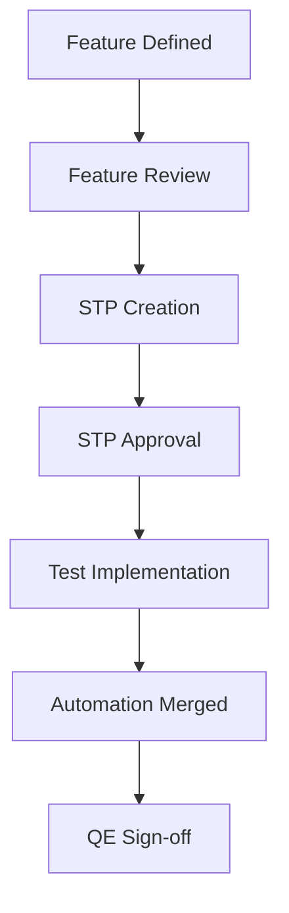

# OpenShift Virtualization Quality Engineering Repository

This repository manages Quality Engineering (QE) artifacts, test plans, and testing strategies for OpenShift Virtualization enhancements, ensuring features meet defined quality standards before release.

## Purpose

Centralize QE documentation and test planning to ensure:

- **Clear visibility** of test coverage, resources, and risks
- **Systematic quality assurance** for all OpenShift Virtualization features
- **Formal QE sign-off** requirements are met
- **Automation is merged for GA** (mandatory)

## Quick Start

### For QE Engineers

1. **New Feature?** → Start with the [STP Guide](./docs/stp-guide.md)
2. **Planning Tests?** → Read [Testing Tiers Guide](./docs/testing-tiers.md)
3. **Writing STP?** → Use the [STP Template](./stps/stp-template/stp.md)

### For Developers

- **Understanding QE Process** → See [STP Guide](./docs/stp-guide.md)
- **Test Requirements** → Review [Testing Tiers](./docs/testing-tiers.md)
- **Approval Process** → Check [Process Flow](#process-flow-feature-to-qe-sign-off)

## Documentation

### Core Guides

| Guide                                          | Description                                                                        |
|:-----------------------------------------------|:-----------------------------------------------------------------------------------|
| [STP Guide](./docs/stp-guide.md)               | Complete guide to Software Test Plans: structure, lifecycle, and best practices    |
| [Testing Tiers Guide](./docs/testing-tiers.md) | Differences between Unit Tests, Tier 1 (Functional), and Tier 2 (End-to-End) tests |

### Templates

| Template                                   | Purpose                                         |
|:-------------------------------------------|:------------------------------------------------|
| [STP Template](./stps/stp-template/stp.md) | Software Test Plan template for feature testing |

## Key Concepts

### Glossary

| Term       | Definition                                                            |
|:-----------|:----------------------------------------------------------------------|
| **STP**    | Software Test Plan - Overall roadmap for testing                      |
| **NFR**    | Non-Functional Requirements (performance, security, monitoring, etc.) |
| **Tier 1** | Functional tests covering individual features                         |
| **Tier 2** | End-to-end tests covering complete workflows                          |

### Testing Tiers

```text
Unit Tests → Tier 1 (Functional) → Tier 2 (End-to-End)
  Many          Moderate              Few
Isolated       Feature-level      Full Integration
```

See [Testing Tiers Guide](./docs/testing-tiers.md) for details.

## Process Flow: Feature to QE Sign-off



### Milestones

1. **Feature Review (Pre-STP)**
   - QE reviews feature requirements and enhancements
   - Developer Handoff/QE Kickoff meeting
   - Confirms testability and acceptance criteria

2. **STP Creation**
   - Document scope, strategy, environment, risks
   - Define Tier 1 and Tier 2 test coverage
   - List untestable aspects with stakeholder agreement

3. **Enhancement Freeze (EF)**
   - STP written, reviewed, and approved
   - Entry criteria met before testing begins

4. **Test Implementation**
   - Develop test cases per STP
   - Implement automation
   - Track against exit criteria

5. **Code Freeze (CF)**
   - **Test automation must be merged for GA**
   - All high-priority defects resolved
   - Exit criteria met

6. **QE Sign-off**
   - Feature meets all acceptance criteria
   - Automation running in release checklist jobs
   - Documentation reviewed and approved

## Development Setup

### Markdown Linting

This repository uses automated linting to maintain consistent Markdown formatting.

#### Prerequisites

```bash
# Install pre-commit
pip install pre-commit

# Install pre-commit hooks
pre-commit install
```

#### Running Linters

```bash
# Run all pre-commit hooks manually
pre-commit run --all-files

# Run on specific files
pre-commit run --files README.md docs/stp-guide.md
```

See `.markdownlint.yaml` for complete configuration with detailed comments for each rule.

## Responsibilities

### QE Owner

- Write and maintain STP
- Review design and identify testing challenges
- Ensure NFRs are addressed
- Manage risks and document untestable aspects
- Ensure automation runs in release checklist jobs
- Provide formal feature sign-off

### Stakeholders (SIGs/Approvers)

- Approve STP
- Agree to risks associated with untestable aspects
- Coordinate feature enhancement and STP reviews

## Common Questions

| Question                                      | Answer                                                                                    |
|:----------------------------------------------|:------------------------------------------------------------------------------------------|
| **Do PRs need STP approver sign-off?**        | No, the whole SIG is responsible for code approval. Approvers should be aware of the STP. |
| **What if PRs miss the deadline?**            | STP author files for an exception; maintainers decide based on context.                   |
| **How to raise attention for my STP?**        | Join bi-weekly QE recurring meetings to introduce your STP.                               |
| **What if feature relates to multiple SIGs?** | One SIG must own it. Reach out to other relevant SIGs for review.                         |

## Resources

### Internal

- [STP Guide](./docs/stp-guide.md)
- [Testing Tiers Guide](./docs/testing-tiers.md)
- [STP Template](./stps/stp-template/stp.md)

## Contributing

1. Create STP using the [template](./stps/stp-template/stp.md)
2. Follow the [STP Guide](./docs/stp-guide.md) for structure and content
3. Ensure proper test tier coverage per [Testing Tiers Guide](./docs/testing-tiers.md)
4. Get stakeholder approval before testing begins
5. Ensure automation is merged before GA

## Support

For questions or assistance:

- Join QE bi-weekly meetings
- Open an issue in this repository
- Contact the QE team lead
